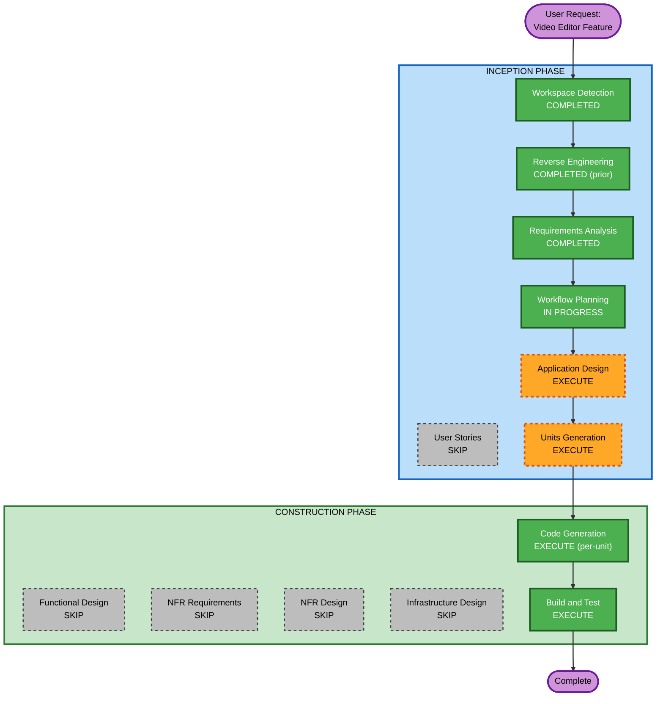

# Execution Plan — Video Editor Feature

## Detailed Analysis Summary

### Transformation Scope
- **Transformation Type**: Multi-component feature addition (Frontend + Backend + Data Model)
- **Primary Changes**: New Editor page UI, new Tauri commands, project.json schema extension
- **Related Components**: Frontend (Editor page), Backend (commands, storage), Existing project system

### Change Impact Assessment
- **User-facing changes**: Yes — New full editor UI with video playback, subtitle editing, style/overlay configuration
- **Structural changes**: Yes — New Rust command module, new frontend page with multiple sub-components
- **Data model changes**: Yes — Extend project.json with `editor_style` + `editor_overlays` fields, extend subtitles.json with `is_new` field
- **API changes**: Yes — 4 new Tauri commands (load_editor_project, save_editor_project, get_recent_project, list_editor_projects)
- **NFR impact**: Moderate — Video playback performance, 500+ subtitle rows handling

### Component Relationships
```
Frontend Editor Page
├── VideoPlayer (depends on: asset:// protocol, subtitle data)
├── SubtitleTable (depends on: subtitles.json data)
├── StylePanel (depends on: project.json editor_style)
├── OverlayPanel (depends on: project.json editor_overlays)
└── EditorToolbar (depends on: project metadata)

Backend Commands (new module: commands/editor.rs)
├── load_editor_project → storage.rs (read project.json + subtitles.json)
├── save_editor_project → storage.rs (write project.json + subtitles.json)
├── get_recent_project → storage.rs (read app_data.json)
└── list_editor_projects → storage.rs (list projects/)

History Page (existing, minor modification)
└── Add "Edit" button → navigates to Editor tab with project_id
```

### Risk Assessment
- **Risk Level**: Medium
- **Rollback Complexity**: Easy (new files, minimal changes to existing)
- **Testing Complexity**: Moderate (video playback + state management + file I/O)

---

## Workflow Visualization



---

## Phases to Execute

### INCEPTION PHASE
- [x] Workspace Detection (COMPLETED — prior lifecycle)
- [x] Reverse Engineering (COMPLETED — artifacts current)
- [x] Requirements Analysis (COMPLETED — 11 FRs defined)
- [x] User Stories — SKIP
  - **Rationale**: Single user type (video editor user), clear requirements with mockup, no complex personas needed
- [x] Workflow Planning (IN PROGRESS)
- [ ] Application Design — EXECUTE
  - **Rationale**: New components needed (Editor commands module), new service layer for editor operations, component dependencies need clarification between FE and BE
- [ ] Units Generation — EXECUTE
  - **Rationale**: Feature spans backend (Rust commands + storage) and frontend (multiple components), benefits from structured decomposition into units

### CONSTRUCTION PHASE
- [ ] Functional Design — SKIP
  - **Rationale**: Business logic is straightforward CRUD (read/write subtitles + style). No complex algorithms or state machines needed beyond what's in requirements.
- [ ] NFR Requirements — SKIP
  - **Rationale**: Performance needs (smooth video playback, 500+ rows) are addressed by standard approaches (virtual scrolling, efficient re-render). No special NFR patterns needed.
- [ ] NFR Design — SKIP
  - **Rationale**: NFR Requirements skipped
- [ ] Infrastructure Design — SKIP
  - **Rationale**: Desktop app — no cloud infrastructure. Storage is local filesystem (already established pattern).
- [ ] Code Generation — EXECUTE (per-unit, always)
  - **Rationale**: Implementation of all units (backend commands + frontend components)
- [ ] Build and Test — EXECUTE (always)
  - **Rationale**: Verify cargo check + tsc + vite build pass; provide test instructions

### OPERATIONS PHASE
- [ ] Operations — PLACEHOLDER

---

## Estimated Timeline
- **Total Stages to Execute**: 5 (Application Design, Units Generation, Code Generation per-unit, Build and Test)
- **Total Stages to Skip**: 6 (User Stories, Functional Design, NFR Req, NFR Design, Infra Design, Operations)

## Success Criteria
- **Primary Goal**: Working video editor with subtitle CRUD, real video playback + overlay, style/overlay configuration, manual save — all integrated with existing project system
- **Key Deliverables**:
  1. Backend: 4 new Tauri commands in `commands/editor.rs`
  2. Frontend: Complete Editor page (VideoPlayer, SubtitleTable, StylePanel, OverlayPanel, EditorToolbar)
  3. Data model: Extended `project.json` and `subtitles.json` schemas
  4. Integration: History → Editor navigation, auto-open most recent project
- **Quality Gates**:
  - `cargo check` passes (0 errors)
  - `tsc --noEmit` passes (0 errors)
  - `vite build` succeeds
  - Editor loads project data from disk correctly
  - Video plays with subtitle overlay synced to time
